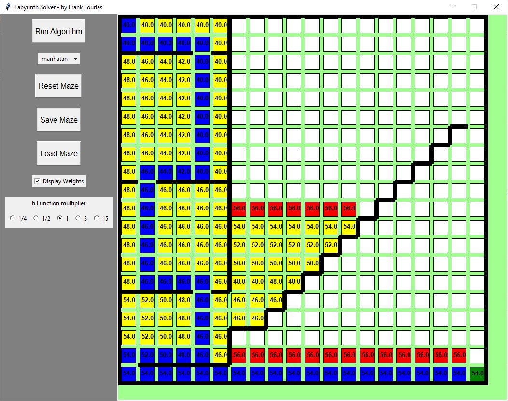

# labyrinth_solver

## A* Algorithm
This program contains an implemetation of the A* algorithm focused on solving 2D mazes. The algorithm is wraped arround a nice GUI with some customization features.

> For reference the f value of a node in A* is `f=g+h` where: g is the until-then true distance of a node from the start, h is the estimated (based on an h-function) distance of a box to the end node.

## How to use
No requirements. Just a plain Python3 installation!

* Run the program.py script and you will see a 20x20 grid. Path-finding always begins top-left and finishes bottom-right. Click between the white boxes to add walls that block the path from one box to the next one. Currently the algorithm does not allow moving diagonally.
* To make things quicker click the Save/Load Maze buttons to save and load the mazes you create in JSON format.
* The dropdown menu under the "Run Algorithm" button changes the h-function to calculate the Eucledean or the Manhattan distance from one box to the end node. You can experiment with this to see what works best and when.
* The "Display Weights" checkbox enables/disables printing the current f-value 
* Changing the h-function multiplier changes the f-value to `f=g+mul*h` where mul is the multiplier. This will alter the behavour of the algorithm. A multiplier lower than 1 just makes the algorithm slower (based on tests). A multiplier greater than 1 might make the algorithm run significantly faster for many test-cases (but slower in more complex ones based on tests) and it kills the "Best" property of A*. By multiplying the h-function you make it not admissible, meaning it over-estimates the distance to the end. A* will always provide a path from start to end but this will be the optimal (best) when the h-function applies relaxation (under-estimates).

## How to modify
Modification of the GUI can be made by altering the first lines of the code. `size_x` and `size_y` refer to the grid dimensions and `box_px` and `wall_px` to the thickness of the boxes and walls in pixels.

Colours are managed in the `update_canvas(self)` function of the App class in the "Print Squares" section

The actual algorithm runs in the tkinter mainloop that is implemented in the `open(self)` function of the App class. Running is controlled by the `self.ALGORITHM` variables that gets set in the `run_algorithm(self)` function.

Each node is a `Node` object that contains coordinates, visited and (member of the) path bools, g and h values, f function and a function to change the h-function
